# Huawei In-App Purchases (IAP) Demo

The iap_demo App demonstrates Huawei In-App Purchases (IAP) client APIs and usages.

Documentation can be found at this
[link](https://developer.huawei.com/consumer/en/doc/development/HMS-Guides/iap-introduction).

## Table of Content

- [Huawei In-App Purchases (IAP) Demo](#huawei-in-app-purchases-iap-demo)
  - [Table of Content](#table-of-content)
  - [Introduction](#introduction)
  - [Environment requirement](#environment-requirement)
    - [Develop requirement](#develop-requirement)
    - [Runtime requirement](#runtime-requirement)
  - [Installation](#installation)
  - [Configuration](#configuration)
  - [Tutorial](#tutorial)
    - [Purchasing consumable product](#purchasing-consumable-product)
    - [Purchasing non-consumable product](#purchasing-non-consumable-product)
    - [Purchasing auto-renewable subscription service](#purchasing-auto-renewable-subscription-service)
  - [Code Examples](#code-examples)
    - [Query purchased products](#query-purchased-products)
    - [Make Purchases](#make-purchases)
    - [Jump to subscription management and detail pages](#jump-to-subscription-management-and-detail-pages)
  - [Licensing](#licensing)

## Introduction

Huawei In-App Purchases provides 3 types of product: consumable, non-consumable and
auto-renewable subscription.

* Consumable : Consumables are product that can be consumed once. When consumed, it's
    depleted and can be purchased again.

* Non-consumable : Non-consumables can be only purchased once and do not expire.

* Auto-renewable subscription : Once purchased, Users can access to value-added functions
    or content in a specified period of time. The subscriptions will automatically renew on
    a recurring basis until users decide to cancel.

This demo app provides all 3 types of product to demonstrate the procedure and capability of
Huawei IAP.

## Environment requirement

### Develop requirement

To be able to develop, build and debug this demo, you will need at least the following environment:

* a connection to Internet, for downloading package dependencies form Huawei and Google

* a compatible IDE, Android Studio is recommended.

* a gradle installation will be downloaded when you use command line gradle wrapper or
    open downloaded folder in compatible IDE

* an Android SDK installation, API version 28 or above is recommended.

### Runtime requirement

To be able to run this demo, you will need an Android device with EMUI 5.0 or above,
Android 4.4 and above, with Huawei Mobile Service (HMS) pre-installed.

If the HMS is missing, the device will prompt you to install or upgrade HMS first on calling IAP SDK.

## Installation

1. Clone or download this project and open the downloaded folder in Android Studio or compatible IDE.

2. Use IDE's functionality to install configured project on to your device.

## Configuration

This demo come with pre-configured `agconnect-services.json`, HMS dependencies, signing keys and
in-app products. These pre-configured settings are for demo purpose only, please refer to the
[Documentation](https://developer.huawei.com/consumer/en/doc/development/HMS-Guides/iap-configuring-appGallery-connect)
for guide of adopting Huawei IAP.

## Tutorial

Once you start the demo, you should be able to see the following page.

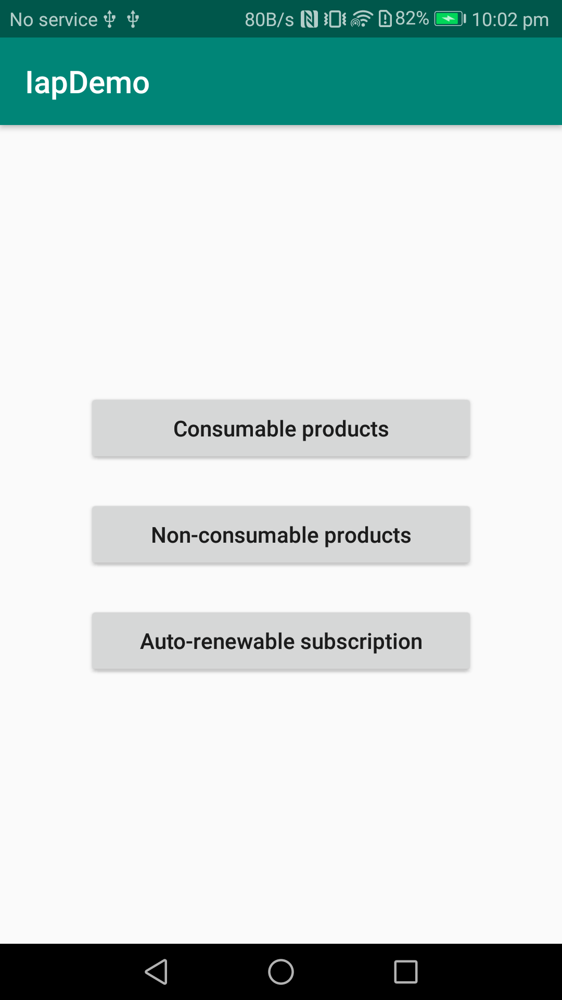

Disclaimer: The demo only demonstrates the purchase procedure, and it does not have a real use of purchased products.

### Purchasing consumable product

The demo provides *gem* as an example of consumable product.

1. Tap **Consumable products**, you should be able to see the home page for consumable demo.
    The demo will call the `obtainProductInfo` API, to query the detail of managed products.
    (And also retries `consumeOwnedPurchase`, see below.)

    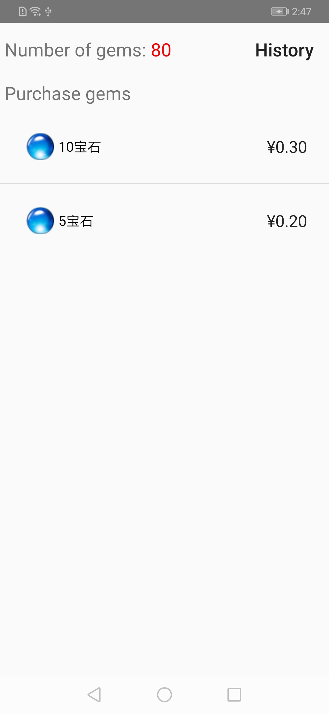

2. Tap **5 gems**, the demo will call the `createPurchaseIntent` API,
    and jump to the checkout page which is provided by IAP Service.

    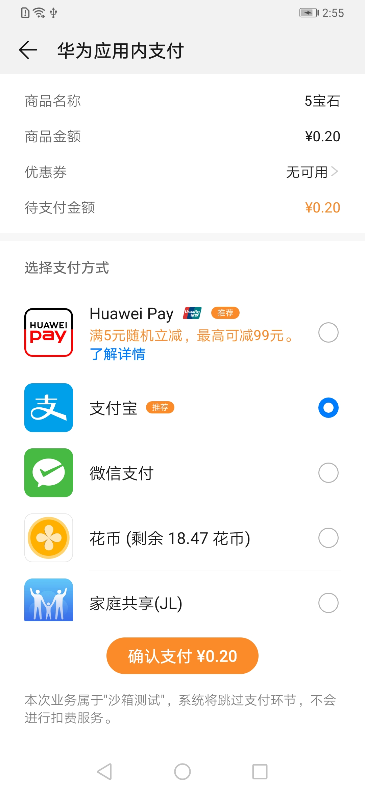

3. Once payment finishes, the consumable demo will increase user's gems counter
    and call `consumeOwnedPurchase` API to notify Huawei IAP Service that user has consumed the purchase.

    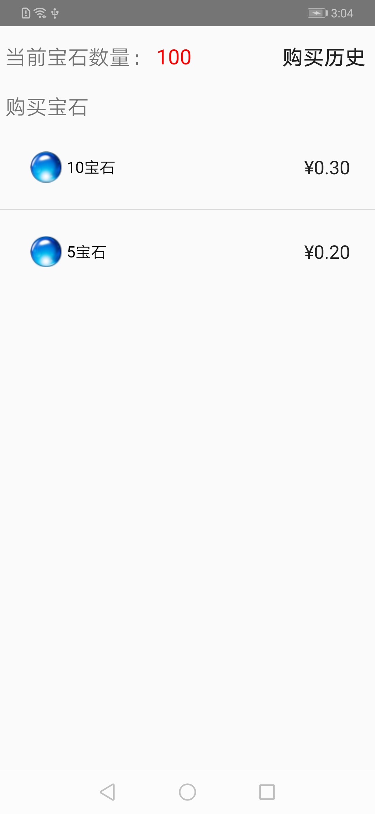

    Note: If an exception (such as network error or process termination) occurs
    after a successful payment, the demo app will attempt to update the gem count
    when you re-enter the page. (Using `obtainOwnedPurchases` API to obtain consumable
    purchases and `consumeOwnedPurchase` to retry consuming purchases)

    Note: In production you should validate the result on server side (deliver the purchase)
    before calling `consumeOwnedPurchase`.

4. Tap **History**, the demo will call the `obtainOwnedPurchaseRecord` API to obtain the purchase history.

    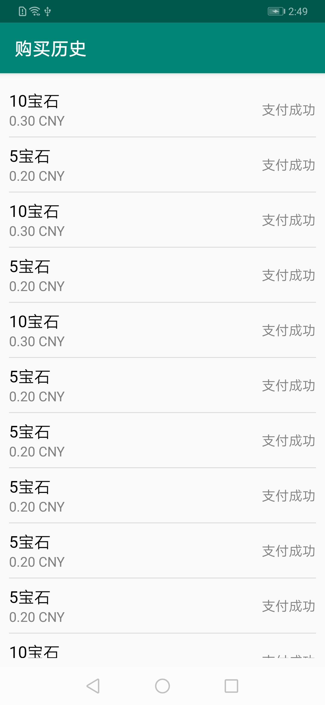

### Purchasing non-consumable product

The demo provides *hidden level* as an example of non-consumable product.

1. Tap the **Non-consumable product**, you should be able to see the home page for non-consumable demo.
    The demo will call the `obtainOwnedPurchases` API to obtain purchased non-consumable product.

2. Assuming you have not purchased the *hidden level*, you will see the following screenshot.
    Tap **hidden level** to start the purchase procedure (which is the same as purchasing consumable product).

    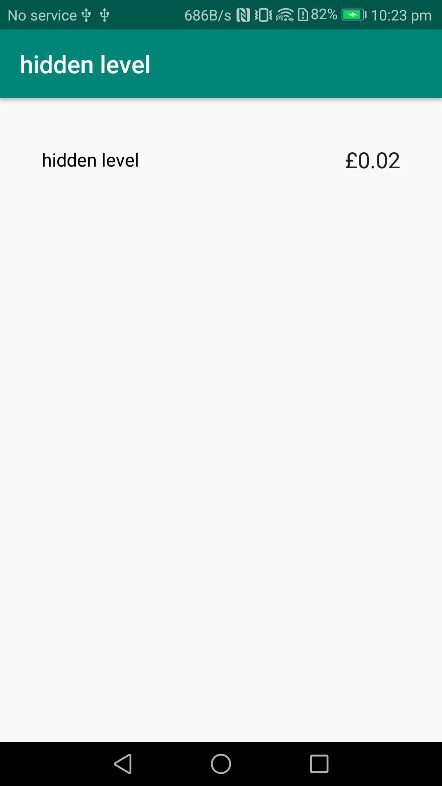

3. After the purchase finishes (Or you have purchased the *hidden level* before),
    the demo will display the hidden level as purchased.

    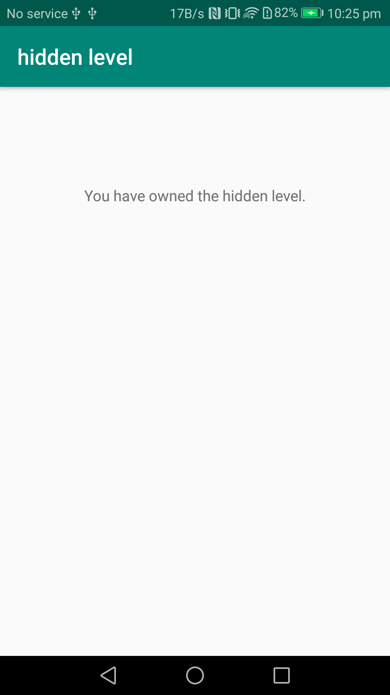

### Purchasing auto-renewable subscription service

The demo provides *Service-One* and *Service-Two* as examples of subscription group,
each contains 2 options of auto-renewable subscription.

(For more detail of subscription and subscription group, see related
[documentation](https://developer.huawei.com/consumer/en/doc/development/HMS-Guides/iap-subscription-scenario).)

1. Tap the **Auto-renewable subscription**, you should be able to see the home page for auto-renewable subscription demo.
    The demo will call the `obtainOwnedPurchase` API to obtain purchased subscription product.
    Active subscription will be displayed as ACTIVE.

    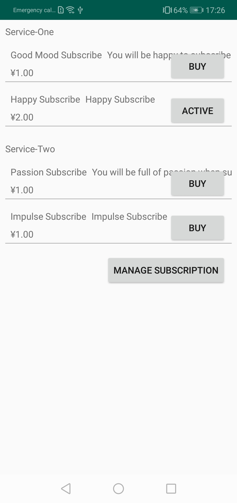

2. Tap one of **BUY** buttons, the demo will start the purchase procedure by calling `createPurchaseIntent`.

    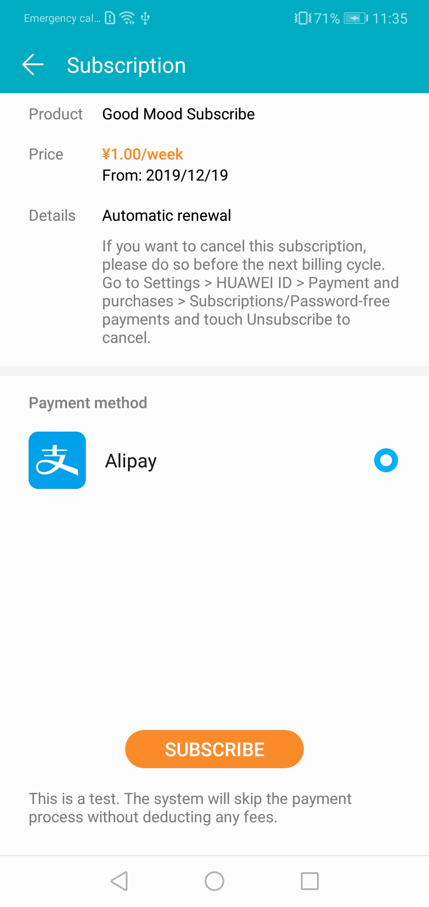

    Note: currently we only support Alipay for subscription payment.

3. You will be prompted to authorize automatic fee deduction agreement.
    Once purchase succeed, IAP Service will display the purchase result.

    

4. Tap **Manage Subscription**, the demo will jump to subscription manage page.
    The page will list all subscribed products, including expired subscriptions.

    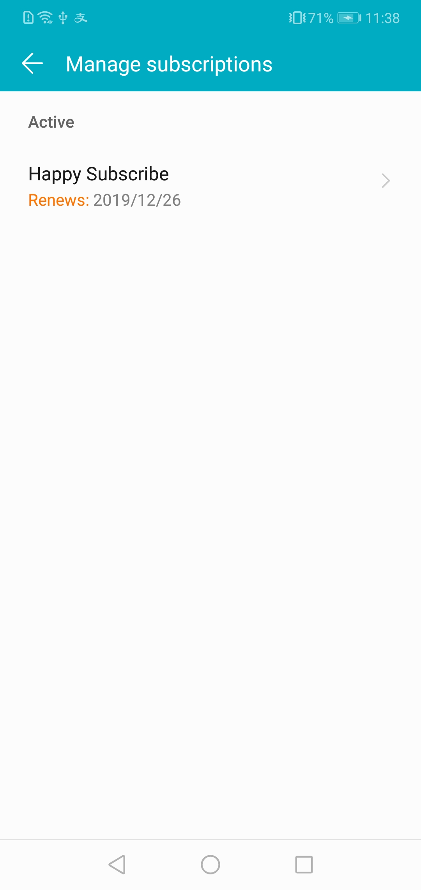

5. Tap **Happy Subscribe** on Subscription manage page, you will be able to edit subscription and choose other subscription options
    in same subscription group, or tap **UNSUBSCRIBE** to cancel the subscription. The subscription will remain valid until the expire
    date.

    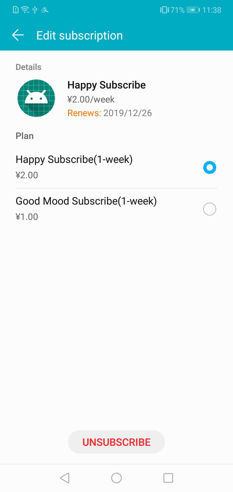

## Code Examples

### Query purchased products

Query the user's ordered product information according to the query type.

The products include consumable products, non-consumable products and auto-renewable subscription products.

When the type set to subscription, `obtainOwnedPurchase` returns subscriptions that the user
has in this application, including the following subscription status:

- Renewal (normal state, subscription will be renewed in the next cycle)

- Expires (the renewal has been canceled, after this cycle becomes expired, there will be no renewal for the next cycle)

- Expired (subscription is invalid, but can still be found in the subscription history)

For more detail, please refer to `IapRequestHelper.java`.

### Make Purchases

Make purchase according to the purchase type and product ID type.

The products include consumable products, non-consumable products, and auto-renewable subscription products.

For more detail, please refer to `IapRequestHelper.java`.

### Jump to subscription management and detail pages

Your application can jump to the *Manage Subscription* Page and *Subscription Details* Page via url schemes.

If the parameter `sku` is empty, the app will jump to the management subscription page.
The page displays the list of products that the current user has subscribed to in your application.

If the parameter `sku` is not empty, it jumps to the subscription details page.
The detail page will also display other product information for the same product subscription group.

For more detail, please refer to `IapRequestHelper.java`.

## Licensing

This demo is licensed under the [Apache License, version 2.0](http://www.apache.org/licenses/LICENSE-2.0).
