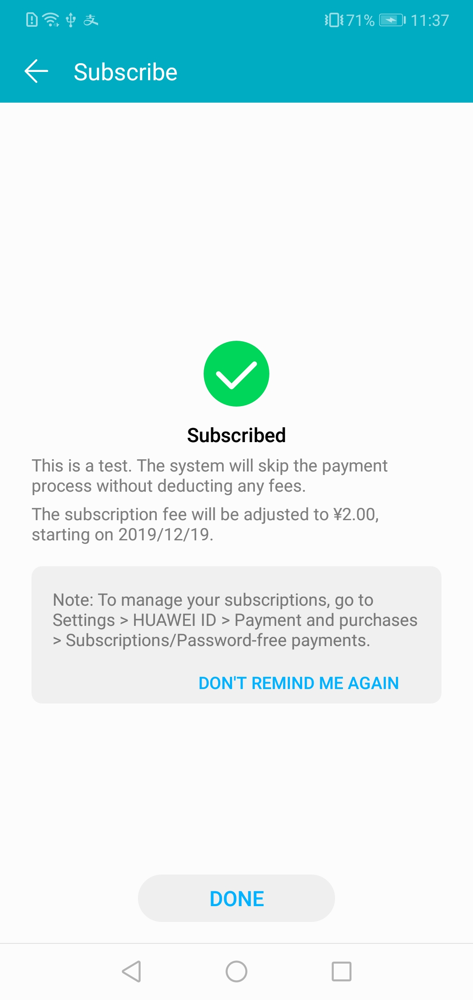

# 华为应用内支付服务客户端示例代码

本章节主要介绍接入华为应用内支付的客户端开发步骤，帮助您快速了解华为支付提供的客户端接口及其使用方法。

点击[此处](https://developer.huawei.com/consumer/cn/doc/development/HMSCore-Guides/introduction-0000001050033062)了解更多。

## 目录
  - [简介](#简介)
  - [开发准备](#开发准备)
  - [环境要求](#环境要求)
  - [运行结果](#运行结果)
    - [购买消耗型商品](#购买消耗型商品)
    - [购买非消耗型商品](#购买非消耗型商品)
    - [购买订阅型商品](#购买订阅型商品)
  - [技术支持](#技术支持)
  - [授权许可](#授权许可)

## 简介

华为应用内支付服务（HUAWEI In-App Purchases）支持3种商品，包括消耗型商品、非消耗型商品和订阅型商品。

* 消耗商品：仅能使用一次，消耗使用后即刻失效，需再次购买。

* 非消耗商品：一次性购买，永久拥有，无需消耗。

* 订阅型商品：用户购买后在一段时间内允许访问增值功能或内容，周期结束后自动续期购买下一期的服务。

本Demo将基于这3种商品来演示华为应用内支付服务的接入过程和功能。

本demo仅演示商品购买过程，并未实际使用购买的商品。

该示例也可以通过HMS Toolkit快速启动运行，且支持各Kit一站式集成，并提供远程真机免费调测等功能。了解更多信息，请参考HMS Toolkit官方链接：https://developer.huawei.com/consumer/cn/doc/development/Tools-Guides/getting-started-0000001077381096

## 开发准备

1. 检查Android Studio开发环境是否准备就绪。如果是，则使用Android Studio打开示例代码工程路径下的build.gradle文件。
2. 在AppGallery Connect中创建应用并配置应用信息。详情请参见：[配置AppGallery Connect](https://developer.huawei.com/consumer/cn/doc/development/HMSCore-Guides/config-agc-0000001050033072)。
3. 在AppGallery Connect中添加商品信息。详情请参见：[配置商品信息](https://developer.huawei.com/consumer/cn/doc/development/HMSCore-Guides/config-product-0000001050033076)。
4. 在Android Studio（3.0及以上版本）导入demo，再进行构建。
5. 配置示例代码：

   * 在AppGallery Connect中下载应用的agconnect-services.json文件，把该文件添加至本demo的应用根目录(\app)中。
   * 添加证书文件，在应用级build.gradle文件中添加配置。
   * 打开AndroidManifest文件，修改package为您的应用包名
   * 将CipherUtil类中的PUBLIC_KEY替换为创建应用的公钥。获取公钥详情，参考查询支付服务信息
   * 将本demo中的商品替换为你的商品。
6. 在Android设备或模拟机上运行该示例代码。

## 环境要求

推荐使用Android SDK 22版本及以上、JDK版本1.8及以上。

## 运行结果

Demo运行后，会出现如下页面。

### 购买消耗型商品

以游戏中的*gem*，演示消耗型商品购买。

1. 点击**Consumable products**，可以看到购买消耗型商品的主页。调用`obtainProductInfo`接口，获取此类商品的详细信息。

   

2. 点击**5 gems**，Demo会调用`createPurchaseIntent`接口，跳转至华为应用内支付收银台。

    

    点击**10 gems**，Demo会调用`createPurchaseIntentWithPrice`接口，跳转至华为应用内支付收银台。

3. 付款成功后，Demo会增加用户的钻石数量，然后调用`consumeOwnedPurchase`接口，通知华为应用内支付服务端用户已完成消耗。

    

   注意：如果付款成功后出现异常（如网络错误或流程终止），Demo将在您重新进入页面时尝试更新钻石数量。（调用`obtainOwnedPurchases`接口，获取已购消耗型商品的购买数据。调用`consumeOwnedPurchase`接口，消耗该商品。）

4. 点击**History**，Demo会调用`obtainOwnedPurchaseRecord`接口，获取购买历史。

    

### 购买非消耗型商品

Demo以*hidden level*商品为例，演示非消耗型商品购买。

1. 点击**Non-consumable product**，可以看到购买非消耗型商品的主页。调用`obtainOwnedPurchases`接口，获取非消耗型商品。

2. 如果你还没购买*hidden level*，可以看到如下图所示页面。点**hidden level**，开始购买，步骤和购买消耗型商品一致。

    

3. 购买成功后（或之前已购买*hidden level*商品），Demo将显示hidden level已经购买。

    

### 购买订阅型商品

Demo以*Service-One*和*Service-Two*为订阅群组进行演示，每个订阅组包含2个订阅选项。

(如想了解更多关于订阅及订阅群组的信息，请查看相关[文档](https://developer.huawei.com/consumer/cn/doc/development/HMSCore-Guides/subscription-functions-0000001050130264).)

1. 点击**Auto-renewable subscription**，可以看到订阅型商品的主页。调用`obtainOwnedPurchase`接口，获取购买的订阅商品信息。用户已订阅的商品将显示为ACTIVE。

    

2. 点击其中一个**BUY**按钮，Demo将调用`createPurchaseIntent`接口，开始购买。

    

   注意：目前订阅商品付款方式仅支持支付宝。

3. 系统将提示您授权自动扣费协议。购买成功后，华为应用内支付服务将显示购买结果。

    

4. 点击**Manage Subscription**，演示应用将跳转至订阅管理页面。该页面显示所有订阅商品，包括已过期的商品。

    

5. 在订阅管理页面点击**Happy Subscribe**，可以编辑订阅商品，选择同一订阅组中的其他订阅商品，或点击**UNSUBSCRIBE**，取消订阅该商品。订阅商品在到期前一直有效。

    

## 技术支持
如果您对HMS Core还处于评估阶段，可在[Reddit社区](https://www.reddit.com/r/HuaweiDevelopers/)获取关于HMS Core的最新讯息，并与其他开发者交流见解。

如果您对使用HMS示例代码有疑问，请尝试：
- 开发过程遇到问题上[Stack Overflow](https://stackoverflow.com/questions/tagged/huawei-mobile-services)，在`huawei-mobile-services`标签下提问，有华为研发专家在线一对一解决您的问题。
- 到[华为开发者论坛](https://developer.huawei.com/consumer/cn/forum/blockdisplay?fid=18) HMS Core板块与其他开发者进行交流。

如果您在尝试示例代码中遇到问题，请向仓库提交[issue](https://github.com/HMS-Core/hms-iap-clientdemo-android-studio/issues)，也欢迎您提交[Pull Request](https://github.com/HMS-Core/hms-iap-clientdemo-android-studio/pulls)。

## 授权许可

华为应用内支付服务服务端示例代码经过[Apache License 2.0](http://www.apache.org/licenses/LICENSE-2.0)授权许可。
