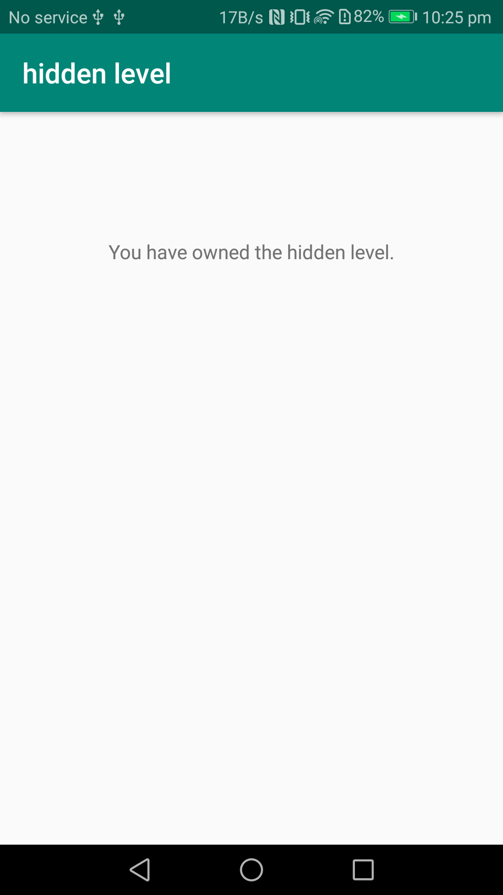

# 华为应用内支付服务客户端示例代码

本章节主要介绍接入华为应用内支付的客户端开发步骤，帮助您快速了解华为支付提供的客户端接口及其使用方法。

点击[此处](https://developer.huawei.com/consumer/cn/doc/development/HMS-Guides/iap-introduction)了解更多。

## 目录

- [华为应用内支付服务客户端示例代码](#华为应用内支付服务客户端示例代码)
  - [目录](#目录)
  - [简介](#简介)
  - [环境要求](#环境要求)
    - [开发环境](#开发环境)
    - [运行环境](#运行环境)
  - [安装](#安装)
  - [配置](#配置)
  - [使用示例](#使用示例)
    - [购买消耗型商品](#购买消耗型商品)
    - [购买非消耗型商品](#购买非消耗型商品)
    - [购买订阅型商品](#购买订阅型商品)
  - [示例代码](#示例代码)
    - [查询已购商品](#查询已购商品)
    - [购买商品](#购买商品)
    - [提供订阅管理的页面跳转](#提供订阅管理的页面跳转)
  - [授权许可](#授权许可)

## 简介

华为应用内支付服务（Huawei In-App Purchases）支持3种商品，包括消耗型商品、非消耗型商品和订阅型商品。

* 消耗商品：仅能使用一次，消耗使用后即刻失效，需再次购买。

* 非消耗商品：一次性购买，永久拥有，无需消耗。

* 订阅型商品：用户购买后在一段时间内允许访问增值功能或内容，周期结束后自动续期购买下一期的服务。

本Demo将基于这3种商品来演示华为应用内支付服务的接入过程和功能。

## 环境要求

### 开发环境

开发者需要以下环境进行示例应用开发、构建和调试：

* 网络连接正常，可以从华为或谷歌下载软件依赖包

* 安装兼容的集成开发工具，推荐使用Android Studio 

* 使用gradle wrapper命令行方式或在IDE环境中，下载安装gradle

* 安装Android SDK，API版本推荐28及以上

### 运行环境

运行Demo的设备必须是安装了HMS Core的EMUI 3.0及以上版本、安卓4.4及以上版本的安卓设备。

如未安装HMS Core，设备将在调用IAP SDK时提示您首先安装或升级HMS。

## 安装

1. 从GitHub克隆或下载本项目，通过Android Studio或其他兼容的IDE打开下载的工程文件。

2. 使用IDE将配置好的工程安装到安卓设备。

## 配置

1. 在AppGallery Connect中创建一个应用，获取agconnect-services.json文件，将其添加至项目中。

2.	配置应用签名。
   * 生成签名证书指纹，将证书文件添加至项目中。
   * 配置build.gradle文件。
详情参考[AppGallery Connect配置](https://developer.huawei.com/consumer/cn/doc/development/HMS-Guides/iap-configuring-appGallery-connect)和[集成HMS SDK](https://developer.huawei.com/consumer/cn/doc/development/HMS-Guides/iap-integrating-hms-sdk-v4)。

3.	将CipherUtil类中的PUBLIC_KEY替换为创建应用的公钥。获取公钥详情参考[查询支付服务信息](https://developer.huawei.com/consumer/cn/doc/development/HMS-Guides/appgallery_querypaymentinfo)。

## 使用示例

Demo运行后，会出现如下页面。

声明：本Demo仅演示商品购买过程，并未实际使用购买的商品。

### 购买消耗型商品

以游戏中的*gem*，演示消耗型商品购买。

1. 点击**Consumable products**，可以看到购买消耗型商品的主页。调用`obtainProductInfo`接口，获取此类商品的详细信息。（且调用`consumeOwnedPurchase`接口，如下所示。）

 

2. 点击**5 gems**，用`createPurchaseIntent`接口，跳转至付款页面，该页面跳转由华为应用内支付服务支持。

    

3. 付款成功后，用户钻石数量增加，并会调用`consumeOwnedPurchase`接口，通知华为应用内支付服务端用户已完成消耗。

    

注意：如果付款成功后出现异常（如网络错误或流程终止），Demo将在您重新进入页面时尝试更新钻石数量。（调用`obtainOwnedPurchases`接口，获取已购消耗型商品的购买信息。调用`consumeOwnedPurchase`接口，消耗该商品。）

注意：调用`consumeOwnedPurchase`接口前，您应先在服务器端确认商品是否已经发货。

4. 点击**History**，Demo会调用`obtainOwnedPurchaseRecord`接口，获取购买历史。
    

### 购买非消耗型商品

Demo以*hidden level*商品为例，演示非消耗型商品购买。

1. 点击**Non-consumable product**，可以看到购买非消耗型商品的主页。调用`obtainOwnedPurchases`接口，获取非消耗型商品。

2. 如果你还没购买*hidden level*，可以看到如下图所示页面。点**hidden level**，开始购买，步骤和购买消耗型商品一致。

    

3. 购买成功后（或之前已购买*hidden level*商品），Demo将显示已购的隐藏级别。

    

### 购买订阅型商品

Demo以*Service-One*和*Service-Two*为订阅群组进行演示，每个订阅组包含2个订阅选项。

(如想了解更多关于订阅及订阅群组的信息，请查看相关[文档](https://developer.huawei.com/consumer/cn/doc/development/HMS-Guides/iap-subscription-scenario).)

1. 点击**Auto-renewable subscription**，可以看到订阅型商品的主页。调用`obtainOwnedPurchase`接口，获取购买的订阅商品信息。用户已订阅的商品将显示为ACTIVE。

    

2. 点击其中一个**BUY**按钮，Demo将调用`createPurchaseIntent`接口，开始购买。

    

   注意：目前订阅商品付款方式仅支持支付宝。

3. 系统将提示您授权自动扣费协议。购买成功后，华为应用内支付服务将显示购买结果。

    

4. 点击**Manage Subscription**，演示应用将跳转至订阅管理页面。该页面显示所有订阅商品，包括已过期的商品。

    

5. 在订阅管理页面点击**Happy Subscribe**，可以编辑订阅商品，选择同一订阅组中的其他订阅商品，或点击**Manage Subscription**，取消订阅该商品。订阅商品在到期前一直有效。

    

## 示例代码

### 查询已购商品

可以按类型查询用户订购的商品信息，商品包括消耗型商品，非消耗型商品和订阅型商品。

查询订阅商品时，`obtainOwnedPurchase`接口返回应用中用户的订阅商品，包括如下订阅状态：

- 续订 (订阅商品处于有效状态，下一次的续期也将按期进行扣费以续期。)

- 到期 (订阅续期已被用户取消，将不会进行下一次的续期扣费。)

- 已到期 (订阅商品处于失效状态，可从订阅历史中找到该商品。)

详见`IapRequestHelper.java`文件。

### 购买商品

用户根据购买类型和商品ID进行购买。

商品类型包括消耗型商品、非消耗型商品和订阅型商品。

详见`IapRequestHelper.java`文件。

### 提供订阅管理的页面跳转

开发者的应用可以通过相应地址跳转到**管理订阅页面**和**编辑订阅**页面。

如果`sku`参数为空，应用将跳转至管理订阅页面。该页面展示的是当前用户在开发者应用内已订阅的商品列表。

如果`sku`参数不为空，应用将跳转至编辑订阅页面。该页面展示的是用户已在开发者应用订阅的某个商品详情，以及该商品所在订阅组的其他商品的信息。

详见`IapRequestHelper.java`文件。

## 授权许可

华为应用内支付服务服务端示例代码经过[Apache License 2.0](http://www.apache.org/licenses/LICENSE-2.0)授权许可。
